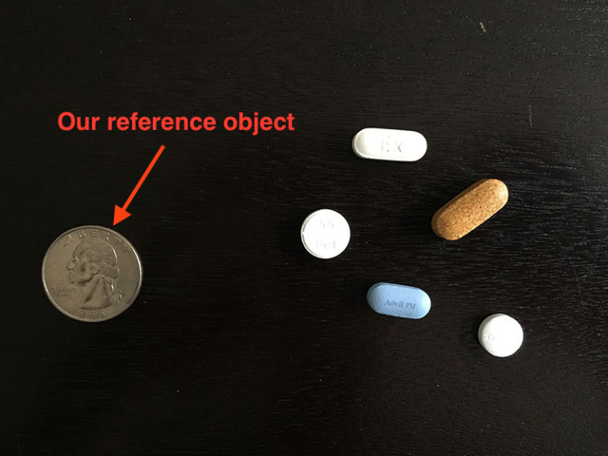

# Measuring-Size-Of-Object-In-Image
The project aims at computing the size of objects in an image using OpenCV.

# Brief Idea Behind the Work

The most common that you probably noticed would be in crime scene photos when an object of known size such as a pencil or even better a ruler is placed next to the object of interests. From this it is very easy to estimage the size of the object of interest.As long as you know the focal length and the object distance, both of which some lenses return to the camera you can calculate the real size of an item in the image. The focal length will give you the lens field of view in terms of degrees.

Measuring the size of objects in an image is similar to computing the distance from our camera to an object — in both cases, we need to define a ratio that measures the number of pixels per a given metric.We can call this the “pixels per metric” ratio.

In order to determine the size of an object in an image, we first need to perform a “calibration” (not to be confused with intrinsic/extrinsic calibration) using a reference object. Our reference object should have two important properties:

<ul>
    <li>We should know the dimensions of this object (in terms of width or height) in a measurable unit (such as millimeters, inches, etc.).</li>
<li>We should be able to easily find this reference object in an image, either based on the placement of the object (such as the reference object always being placed in the top-left corner of an image) or via appearances (like being a distinctive color or shape, unique and different from all other objects in the image). In either case, our reference should should be uniquely identifiable in some manner.</li>
    <ul>
  

        
By guaranteeing the quarter is the left-most object, we can sort our object contours from left-to-right, grab the quarter (which will always be the first contour in the sorted list), and use it to define our pixels_per_metric, which we define as:

<b>pixels_per_metric = object_width / know_width</b>

A US quarter has a known_width of 0.955 inches. Now, suppose that our object_width (measured in pixels) is computed be 150 pixels wide (based on its associated bounding box).

The pixels_per_metric is therefore:

<b>pixels_per_metric = 150px / 0.955in = 157px</b>

Thus implying there are approximately 157 pixels per every 0.955 inches in our image. Using this ratio, we can compute the size of objects in an image.

The description is taken from the article https://www.pyimagesearch.com/2016/03/28/measuring-size-of-objects-in-an-image-with-opencv/

#Requirement
<ul>
  <li>pip install --upgrade imutils</li>
  <li>pip install opencv</li>
  <li>pip install matplotlib</li>
  <li>pip install numpy</li>
  </ul>
