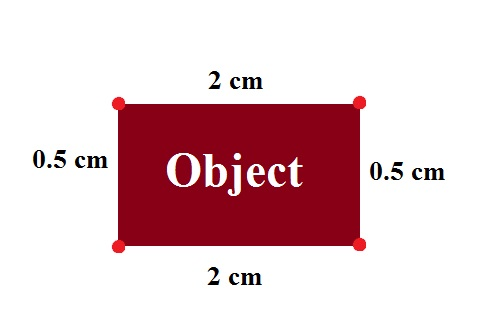

# Measuring-Size-Of-Object-In-Image
The project aims at computing the size of objects in an image using OpenCV.

# Brief Idea Behind the Work
The most common that you probably noticed would be in crime scene photos when an object of known size such as a pencil or even better a ruler is placed next to the object of interests. From this it is very easy to estimage the size of the object of interest.As long as you know the focal length and the object distance, both of which some lenses return to the camera you can calculate the real size of an item in the image. The focal length will give you the lens field of view in terms of degrees.

Measuring the size of objects in an image is similar to computing the distance from our camera to an object — in both cases, we need to define a ratio that measures the number of pixels per a given metric.We can call this the “pixels per metric” ratio.

In order to determine the size of an object in an image, we first need to perform a “calibration” (not to be confused with intrinsic/extrinsic calibration) using a reference object. Our reference object should have two important properties:

The description is taken from the article https://www.pyimagesearch.com/2016/03/28/measuring-size-of-objects-in-an-image-with-opencv/

